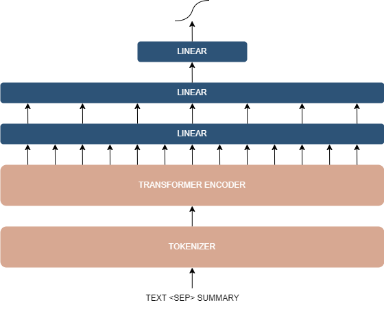
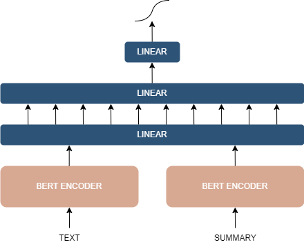
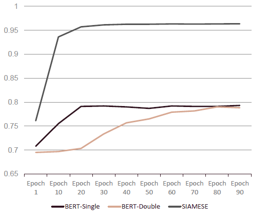

[![Contributors][contributors-shield]][contributors-url]
[![Stargazers][stars-shield]][stars-url]
![GitHub last commit][last-commit-shield]
![GitHub top language][top-language-shield]
![Total Lines][lines-shield]

<!-- PROJECT LOGO -->
 

  

<h3 align="center"><b>Tex</b>(t) <b>Sum</b>(marization) evaluation using Natural Language Processing models</h3>

  

     
    <a href="https://github.com/VasilisAndritsoudis/texsum-cls"><strong>Explore the docs »</strong></a>
  

<!-- TABLE OF CONTENTS -->

  
Table of Contents

  <ol>
    <li>
      <a href="#about-the-project">About The Project</a>
      <ul>
        <li><a href="#built-with">Built With</a></li>
      </ul>
    </li>
    <li>
      <a href="#datasets">Datasets</a>
      <ul>
        <li><a href="#booksum">BOOKSUM</a></li>
        <li><a href="#subpubmed">SubPubMed</a></li>
        <li><a href="#cnn/dailymail">CNN/DailyMail</a></li>
      </ul>
    </li>
    <li>
      <a href="#models">Models</a></li>
      <ul>
        <li><a href="#single-transformer">Single Transformer</a></li>
        <li><a href="#double-transformer">Double Transformer</a></li>
        <li><a href="#siamese">Word2Vec & Siamese</a></li>
      </ul>
    <li><a href="#results">Experiments & Results</a></li>
    <li><a href="#future-work">Future Work</a></li>
  </ol>

<!-- ABOUT THE PROJECT -->
## About The Project 

This project focuses on the evaluation of text summarization techniques, particularly emphasizing the role of state-of-the-art NLP models in enhancing the accuracy and efficiency of summarization systems. Text summarization evaluation is a multidimensional challenge that requires the consideration of various aspects. Traditional evaluation metrics, such as ROUGE (Recall-Oriented Understudy for Gisting Evaluation) and BLEU (Bilingual Evaluation Understudy), have been foundational in assessing summarization systems. However, the limitations of these metrics in capturing semantic nuances and contextual understanding have prompted the exploration of more sophisticated approaches.

We leverage Large Language Models (LLMs) pre-trained on large corpora and fine-tuned for specific tasks. These models demonstrate an unprecedented ability to comprehend and generate human-like text. By harnessing the capabilities of models like BERT (Bidirectional Encoder Representations from Transformers), GPT (Generative Pre-trained Transformer), and their variants, the evaluation process can benefit from a deeper understanding of language context, semantics, and syntactic structures.

(<a href="#readme-top">back to top</a>)

<!-- BUILT WITH -->
### Built With 

![Python][python-shield]
![PyTorch][pytorch-shield]
![Scikit-Learn][scikit-learn]
![Pandas][pandas]
![NumPy][numpy-shield]
![nVIDIA][nvidia-shield]
![Huggingface][huggingface]

(<a href="#readme-top">back to top</a>)

<!-- DATASETS -->
## Datasets 

For the experiments we used three different datasets. These datasets all contain pairs of text and summaries, however they differ semantically and in size. Datasets from the fields of literature, medical scientific publications and news articles were all used for the experimentation process.

The model training and fine-tuning task requires the datasets to be balanced, which means that they have the same number of positive and negative examples. All datasets provide pairs of texts and summaries which are all considered positive examples. In order to create the negative examples needed, we used random sampling to pair texts with random summaries from other texts. This way we generated the necessary number of negative examples in order to balance the dataset before training the models.

(<a href="#readme-top">back to top</a>)

<!-- BOOKSUM -->
### BOOKSUM 

The first corpus we used is BOOKSUM dataset. BOOKSUM is a collection of datasets for long-form narrative summarization. It consists of documents from the literature domain, such as novels, plays and stories, and includes abstractive, human-written summaries on three levels of granularity: paragraph, chapter, and book level. We use chapter-level text, where the average number of tokens is 5101.88 for input chapter and 505.42 for summary. This high average number makes it more difficult and demanding to find good correlations between the summary and the original text, and that is the reason that our models did not perform very well.

(<a href="#readme-top">back to top</a>)

<!-- SUBPUBMED -->
### SubPubMed 

Another corpus we used is the SubPubMed dataset. SumPubMed is a dataset for abstractive summarization over scientific articles. It is based on the PubMed dataset which consists of of more than 26 million citations for biomedical literature from MEDLINE, life science journals, and online books. SumPubMed is based on 33,772 documents identified as BMC (BIO MED CENTRAL) literature which incorporates BMC health services research papers related to medicine, pharmacy, nursing, dentistry, health care, and so on. The average token count for the publications (text) is 4227 and for the abstracts (summaries) is 277. It is clear that this is a long text dataset which cannot fit directly into any transformer model in its raw state, where a more specialized splitting approach is required. This is why our naive approach to just truncate the texts does not seem to produce good results.

(<a href="#readme-top">back to top</a>)

<!-- CNN/DAILYMAIL -->
### CNN/DailyMail 

The final corpus we used is the CNN/DailyMail dataset. The CNN/DailyMail dataset is an English-language dataset containing just over 300k unique news articles as written by journalists at CNN and the Daily Mail. For each article highlight sentences are provided, where for the summarization setting they are concatenated in order to form the summary. It is a much shorter length-wise dataset compared to the previous ones, with average token count for the articles (text) 781 and for the highlights (summaries) 56. Because of its smaller size, in most examples it was possible to almost fit the entirety of the text and summary into the transformer models, thus the produces results were good.

(<a href="#readme-top">back to top</a>)

<!-- MODELS -->
## Models 

Now we will present our processes extract the embedded information from the text and its summary, and then use a simple binary classification method to obtain the final result. <a href="#fig-1">Figure 1</a> depicts the base architecture that all following models follow. Firstly we pass the text and the summary through a tokenizer in order to obtain the text empeddings. Then the embeddings are passed to a transformer encoder network and the last hidden states are passed through a final series of linear layers in order to obtain a single output value. This value is passed through a sigmoid function in order to be transformed into a probability.

(<a href="#readme-top">back to top</a>)

<!-- SINGLE TRANSFORMER -->
### Single Transformer 

The single transformer architecture follows the base architecture exactly. This means that the text and the summary are concatenated and then passed through the tokenizer. Then the embedding produced is passed through the relevant transformer encoder model. Finally the output of the transformer encoder layer is passed through a series of linear layers in order to obtain the final prediction.

  
  
<b>Figure 1</b>: The base model architecture

The text and summarization were appended into a single document which was then passed through the tokenizer. Depending on the tokenizer model being used, different encoding characters were <a href="#fig-1">Figure 1</a>: The base model architecture used to separate the text and summarization. In the case of BERT tokenizer, the format used was: \<CLS> text \<SEP> summarization \<SEP>. The tokenized document was then truncated to fit into the input dimensions of the BERT transformer by truncating the longest sequence first. No other pre-processing was applied to the input documents.

The embeddings produced by the tokenization process were then passed through the BERT transformer model. The model outputs hidden state representations of the data. The last hidden state was taken and inserted into a simple linear neural network. The lin- ear network consists of two dense layers in order to produce the final prediction. Finally, the output was passed through a sigmoid function in order to be transformed into a probability. The whole architecture is trainable, where the linear network layers update their weights in each epoch and the BERT model is finetuned to the dataset.

(<a href="#readme-top">back to top</a>)

<!-- DOUBLE TRANSFORMER -->
### Double Transformer 

Our next model is the double transformer architecture. We consider the fact that transformers have a certain number of tokens that they accept as input. The main idea behind this architecture is to extend the input’s dimension size. Therefore, we do not to concatenate our inputs, but use them as two different parts so as to allow the transformers to process a larger input. In addition, by doing this the model tries to understand what are the main points of each input and learn the features of the document and abstract separately. For example, a text has a specific structure such as beginning, middle, end. A summary usually includes key words, which summarize the main meaning of the text, and also tries to follow the logical order of the text. So we want, by allowing the model to focus on these parts separately, to improve its performance and learn better.

  
  
<b>Figure 2</b>: Double transformer architecture

We pass input text and its summary into two tokenizers and learn their embeddings. We could also try to use a common tokenizer. After that, two different BERT encoders (separately fine-tuned) output the tokenized data and their last hidden state are fed into a simple linear neural network (same as before in Single transformer model). Sigmoid activation function transforms the output into the correlation (probability) of input text and summary. In <a href="#fig-2">Figure 2</a> we present the model’s architecture.

(<a href="#readme-top">back to top</a>)

<!-- WORD2VEC & SIAMESE -->
### Word2Vec & Siamese 

Finally, a Siamese neural network architecture is employed to tackle our task. At the core of this approach lies the concept of using twin networks that share weights and parameters, enabling the model to effectively learn and compare the differences in the semantic relationship between the text and its summary. This model learns a similarity metric between document embeddings by minimizing the Euclidean distance between the embeddings of a document and its corresponding summary.

The model’s foundation is built upon word embeddings. We use Word2vec to generate word embeddings and take the vector of all the words of a text as the text vector. We apply the same technique to create summary vector. Before generating the embeddings, we preprocess our corpus (by removing stop words, converting to lowercase etc). These embeddings serve as the input to the Siamese network, where each pair of text and summary is processed and compared. Through training and evaluation phases, the network learns to discern the degree of similarity between the text and its summarized version. Key performance metrics, including accuracy, F1 score, precision, and recall, were utilized to fine-tune and assess the model’s performance.

(<a href="#readme-top">back to top</a>)

<!-- EXPERIMENTS & RESULTS -->
## Experiments & Results 

Below we present the results of our experiments for each of the models. <a href="#fig-3">Figure 3</a> shows the results after training the best models for each category, single-transformer, double-transformer and Siamese, on the CNN/DailyMail dataset. <a href="#tab-1">Table 1</a> shows the test set results of the four best performing models on the CNN/DailyMail dataset.

<b>Table 1</b>: CNN/DailyMail Dataset test set results

| Metric         | GPT2-Single | BERT-Single | BERT-Double | Siamese
| -------------- | ----------- | ----------- | ----------- | -------
| Accuracy       | 0.711       | 0.689       | 0.697       | 0.954
| F1-Score       | 0.682       | 0.653       | 0.675       | 0.952
| Loss           | 0.439       | 0.605       | 0.612       | 0.123

  
  
<b>Figure 3</b>: CNN/DailyMail Dataset training results

(<a href="#readme-top">back to top</a>)

<!-- FUTURE WORK -->
## Future Work 

Ιn this project, we have only touched the extensive potential inherent in our conceived approach. There are still many experiments that can be carried out to expand our findings. A critical area of future work involves identifying and fine-tuning the most apt model for this task. This includes extensive training across a diverse range of datasets, aimed at refining the model’s adaptability and reliability. Such an effort is crucial to the development of a metric robust enough to be universally applied to various datasets. Additionally, with increased computational power, we plan to test our models against more complex datasets like BOOKSUM and SumPubMed. This move will challenge and potentially elevate the robustness of our models in handling intricate and detailed summaries. Exploring the fusion of Siamese networks with BERT encoders presents a compelling enhancement to our approach, leveraging BERT’s contextual analysis with the comparative strengths of Siamese networks. This integration could significantly refine our text summary evaluation models.

Another promising direction for future research is to collaborate closely with language experts. Their expertise in providing nuanced evaluations of text summaries on a detailed scale from 0 to 100 offers invaluable insights. Incorporating these expert assessments into our training process can significantly elevate the model’s capability. By aligning the model’s output with these expert evaluations, we aim to achieve a more sophisticated and precise approximation of text summary quality. This integration of expert linguistic judgment and advanced machine learning techniques holds the promise of markedly advancing the field of automated text summary evaluation.

Lastly, we aim to delve deeper into Double Encoder models. Their
dual-encoder structure offers a promising avenue for more precise
text relationship analysis.

(<a href="#readme-top">back to top</a>)

<!-- MARKDOWN LINKS & IMAGES -->
<!-- https://www.markdownguide.org/basic-syntax/#reference-style-links -->
[contributors-shield]: https://img.shields.io/github/contributors/VasilisAndritsoudis/texsum-cls.svg?style=for-the-badge
[contributors-url]: https://github.com/VasilisAndritsoudis/texsum-cls/graphs/contributors
[stars-shield]: https://img.shields.io/github/stars/VasilisAndritsoudis/texsum-cls.svg?style=for-the-badge
[stars-url]: https://github.com/VasilisAndritsoudis/texsum-cls/stargazers

[lines-shield]: https://img.shields.io/tokei/lines/github/VasilisAndritsoudis/texsum-cls?style=for-the-badge
[last-commit-shield]: https://img.shields.io/github/last-commit/VasilisAndritsoudis/texsum-cls?style=for-the-badge
[top-language-shield]: https://img.shields.io/github/languages/top/VasilisAndritsoudis/texsum-cls?style=for-the-badge

[python-shield]: https://img.shields.io/badge/python-3670A0?style=for-the-badge&logo=python&logoColor=ffdd54
[pytorch-shield]: https://img.shields.io/badge/PyTorch-%23EE4C2C.svg?style=for-the-badge&logo=PyTorch&logoColor=white
[numpy-shield]: https://img.shields.io/badge/numpy-%23013243.svg?style=for-the-badge&logo=numpy&logoColor=white
[nvidia-shield]: https://img.shields.io/badge/nVIDIA-%2376B900.svg?style=for-the-badge&logo=nVIDIA&logoColor=white
[pandas]: https://img.shields.io/badge/pandas-%23150458.svg?style=for-the-badge&logo=pandas&logoColor=white
[scikit-learn]: https://img.shields.io/badge/scikit--learn-%23F7931E.svg?style=for-the-badge&logo=scikit-learn&logoColor=white
[huggingface]: https://img.shields.io/badge/%F0%9F%A4%97-Transformers-pink?color=FF33CC